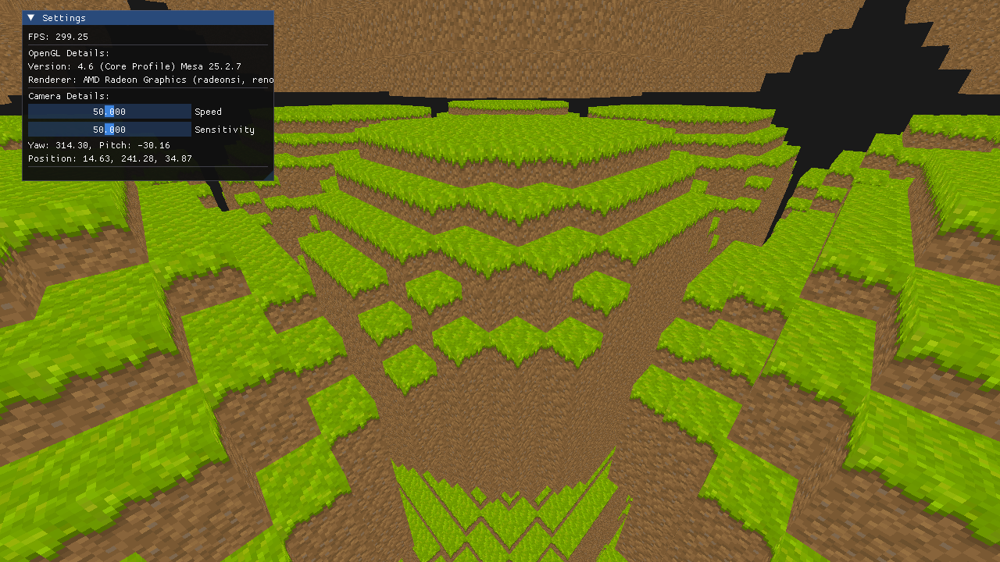

# Krafter

Krafter is a **Minecraft-style voxel sandbox game** built from scratch in **C++20** and **OpenGL 4.5**.



## ✨ Features

- **Modern OpenGL 4.5 renderer**  
  Direct State Access (DSA), Debugging Callback, etc.

- **Configurable settings**  
  Window Size, FOV, Camera Speed, Mouse Sensitivity, etc.

## 🛠️ Tech Stack

- **Language:** C++20
- **Graphics:** OpenGL 4.5
- **Libraries:**
  - GLFW — Windowing & Input
  - GLAD — OpenGL 4.5 Functionalities
  - ImGui — Immediate Mode GUI
  - GLM — Math Library with SIMD Instruction Support
  - stb — Texture File Loading Library
  - FastNoiseLite — Noise Generation Library

## 📦 Building Krafter

### Requirements

- C++20 compiler
- CMake 3.20+
- OpenGL 4.5 capable GPU

### Clone the repository

```bash
git clone --recursive https://github.com/parsajokar/krafter.git
cd krafter
mkdir build
cd build
cmake ..
cd ..
cmake --build build/
./build/krafter
```

### Controls
 - `Space` — Toggling `Viewport Mode` and `Configuration Mode`
 - `WASD + Mouse` — Moving the camera in `Viewport Mode`
